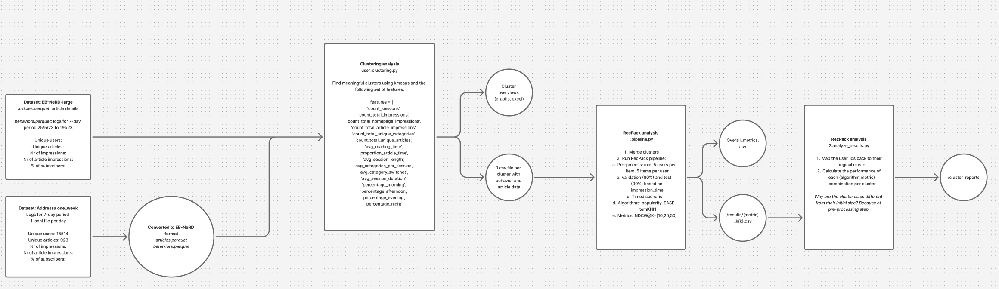

# RICON analysis

## Overview



## Description

This is a monorepo for the analysis for the paper "Not One News Recommender To Fit Them All: How Different News Recommender Strategies Serve Different Engagement-based User Segments"
This repo contains the code for the user clustering and the subsequent cluster analysis using recpack.

We deliberately chose to split the code into two separate parts, to make a clear separation between the clustering itself and the cluster analysis.

## Datasets

The datasets can be downloaded from:

- Ekstra dataset (EB-NeRD): https://recsys.eb.dk/
- Adressa: https://reclab.idi.ntnu.no/dataset/

## How to run

1. Start with the 1-user-clustering folder and follow the instructions in the README there.
2. Then move the resulting clusters to the 2-cluster-analysis folder and follow the instructions in the README there.

## Data used

### Required data fields

To run both analyses in this repository, you need to collect the following data fields:

#### From behaviors/interactions data:
- **`user_id`** - Unique identifier for each user (used in both analyses)
- **`article_id`** - Unique identifier for each article (used in both analyses)
- **`impression_time`** - Timestamp of when the user viewed/interacted with the article (used in both analyses)
- **`session_id`** - Unique identifier for each user session (used in clustering)
- **`read_time`** - Time spent reading the article in seconds (used in clustering)
- **`is_subscriber`** - Boolean indicating if the user is a paid subscriber (used in clustering)
- **`impression_id`** - Unique identifier for each impression/event (used in clustering)

#### From articles data:
- **`article_id`** - Unique identifier for each article (used in both analyses)
- **`category_str`** - Category of the article as a string (used in both analyses: for clustering features and content-based recommendations)
- **`title`** - Title of the article (used in both analyses: for content-based recommendations)
- **`sentiment_score`** - Sentiment score of the article (used in clustering)

### Summary

**Fields used in BOTH analyses:**
- `user_id`
- `article_id`
- `impression_time`
- `category_str`
- `title`

**Fields used ONLY in clustering:**
- `session_id`
- `read_time`
- `is_subscriber`
- `impression_id` (just to count the number of impressions for each user - can be replaced by any other method to count the number of impressions)

**Note:** The recpack evaluation uses `interactions.csv` (created from behaviors data) and `articles_content.csv` (created from articles data with `category_str` and `title` concatenated). The clustering analysis uses the full behaviors and articles datasets to compute user engagement features.

## Unified Pipeline

We provide a master script `run_analysis_pipeline.py` to automate the entire flow from raw parquet files to final RecPack evaluation.

### Prerequisites
- A dataset folder containing `behaviors.parquet` and `articles.parquet`.

### Usage

python run_analysis_pipeline.py --input-dir datasets/ekstra-large --output-dir output/experiment_1### Pipeline Steps
The script automatically:
1.  **Generates Interactions**: Converts `behaviors.parquet` to `interactions.csv`.
2.  **Generates Content**: Converts `articles.parquet` to `articles_content.csv` (combining title + category).
3.  **Runs Clustering**: Clusters users based on engagement features and exports cluster interactions.
4.  **Runs Evaluation**: Executes the RecPack pipeline on the generated clusters.

### Output Structure
The script creates an organized output directory:
```
output_dir/
├── interactions.csv          # Generated interaction matrix
├──
```

## Running in Amazon SageMaker Studio

This section provides step-by-step instructions for running the pipeline in Amazon SageMaker Studio with datasets stored in S3.

### Prerequisites

- An AWS account with access to Amazon SageMaker Studio
- Datasets uploaded to an S3 bucket
- IAM permissions to read from S3 and write to SageMaker Studio

### Step 1: Launch SageMaker Studio

1. Open the [Amazon SageMaker Console](https://console.aws.amazon.com/sagemaker/)
2. Navigate to **SageMaker Studio** in the left sidebar
3. Click **Launch app** → **Studio** (if you don't have a domain, create one first)
4. Wait for the JupyterLab environment to load

### Step 2: Clone or Upload the Repository

**Option A: Clone from Git (recommended)**
```bash
# In a terminal within SageMaker Studio
cd ~/SageMaker
git clone <your-repository-url>
cd not-one-recommender-to-fit-them-all
```

**Option B: Upload via UI**
1. Use the file browser in SageMaker Studio
2. Upload the project files to `~/SageMaker/not-one-recommender-to-fit-them-all/`

### Step 3: Set Up Python Environment

Create a new Python 3.11+ notebook or terminal session and install dependencies:

```python
# In a notebook cell or terminal
import sys
!{sys.executable} -m pip install --upgrade pip

# Install project dependencies
!pip install -r 2-recpack-evaluation/requirements.txt

# Install boto3 for S3 access (if not already installed)
!pip install boto3 s3fs
```

**Note:** For GPU acceleration (recommended for sentence transformers), ensure your SageMaker Studio instance has a GPU-enabled kernel. PyTorch will automatically detect and use the GPU.

### Step 4: Configure AWS Credentials

SageMaker Studio automatically provides AWS credentials via IAM roles. Verify access:

```python
import boto3
import os

# Test S3 access
s3_client = boto3.client('s3')
print("S3 buckets accessible:", [b['Name'] for b in s3_client.list_buckets()['Buckets']])
```

If you need to specify a different AWS profile or region:

```python
import boto3

# Set your S3 bucket and region
S3_BUCKET = 'your-bucket-name'
AWS_REGION = 'us-east-1'  # Change to your region

# Create S3 client
s3_client = boto3.client('s3', region_name=AWS_REGION)
```

### Step 5: Load Datasets from S3

Create a script to download datasets from S3 to your SageMaker Studio environment:

```python
import boto3
import os
import pandas as pd
from pathlib import Path

# Configuration
S3_BUCKET = 'your-bucket-name'
S3_PREFIX = 'datasets/'  # Path prefix in S3 bucket
LOCAL_DATASET_DIR = '2-recpack-evaluation/datasets'

# Create local directories
Path(LOCAL_DATASET_DIR).mkdir(parents=True, exist_ok=True)

# Initialize S3 client
s3_client = boto3.client('s3')

def download_from_s3(s3_key, local_path):
    """Download a file from S3 to local path."""
    print(f"Downloading s3://{S3_BUCKET}/{s3_key} to {local_path}")
    s3_client.download_file(S3_BUCKET, s3_key, local_path)
    print(f"✓ Downloaded {local_path}")

# Download dataset files
datasets = ['adressa-one_week', 'eb-nerd']  # Add your dataset names

for dataset in datasets:
    dataset_path = f"{LOCAL_DATASET_DIR}/{dataset}"
    Path(dataset_path).mkdir(parents=True, exist_ok=True)
    Path(f"{dataset_path}/1.input.clusters").mkdir(parents=True, exist_ok=True)
    
    # Download required files
    files_to_download = [
        f"{S3_PREFIX}{dataset}/interactions.csv",
        f"{S3_PREFIX}{dataset}/articles_content.csv",
    ]
    
    # Download cluster files (adjust pattern based on your S3 structure)
    # Example: cluster_1_merged.csv, cluster_2_merged.csv, etc.
    cluster_files = s3_client.list_objects_v2(
        Bucket=S3_BUCKET,
        Prefix=f"{S3_PREFIX}{dataset}/1.input.clusters/"
    )
    
    if 'Contents' in cluster_files:
        for obj in cluster_files['Contents']:
            if obj['Key'].endswith('.csv'):
                local_cluster_path = f"{dataset_path}/1.input.clusters/{os.path.basename(obj['Key'])}"
                download_from_s3(obj['Key'], local_cluster_path)
    
    # Download main files
    for s3_key in files_to_download:
        try:
            local_file = f"{dataset_path}/{os.path.basename(s3_key)}"
            download_from_s3(s3_key, local_file)
        except Exception as e:
            print(f"Warning: Could not download {s3_key}: {e}")

print("\n✓ All datasets downloaded successfully!")
```

**Alternative: Using s3fs for direct pandas access (for large files)**

```python
import s3fs
import pandas as pd

# Create filesystem interface
fs = s3fs.S3FileSystem()

# Read directly from S3 (useful for large files)
s3_path = f"s3://{S3_BUCKET}/{S3_PREFIX}adressa-one_week/interactions.csv"
df = pd.read_csv(s3_path, storage_options={'key': None, 'secret': None})  # Uses IAM role
```

### Step 6: Run the Pipeline

Navigate to the recpack evaluation directory and run the pipeline:

```python
import os
import sys

# Change to the pipeline directory
os.chdir('2-recpack-evaluation')

# Run pipeline for each dataset
datasets = ['adressa-one_week', 'eb-nerd']

for dataset in datasets:
    dataset_path = f"datasets/{dataset}"
    print(f"\n{'='*60}")
    print(f"Running pipeline for {dataset}")
    print(f"{'='*60}\n")
    
    # Run the pipeline
    os.system(f"python pipeline.py {dataset_path}")
    
    print(f"\n✓ Completed pipeline for {dataset}")

print("\n✓ All pipelines completed!")
```

**Or run from terminal:**

```bash
cd 2-recpack-evaluation

# Run for a specific dataset
python pipeline.py datasets/adressa-one_week

# Or run for all datasets
for dataset in datasets/adressa-one_week datasets/eb-nerd; do
    python pipeline.py $dataset
done
```

### Step 7: Upload Results Back to S3 (Optional)

After running the pipeline, upload results back to S3:

```python
import boto3
import os
from pathlib import Path

s3_client = boto3.client('s3')
S3_BUCKET = 'your-bucket-name'
S3_PREFIX = 'results/'

def upload_to_s3(local_path, s3_key):
    """Upload a file or directory to S3."""
    if os.path.isfile(local_path):
        print(f"Uploading {local_path} to s3://{S3_BUCKET}/{s3_key}")
        s3_client.upload_file(local_path, S3_BUCKET, s3_key)
    elif os.path.isdir(local_path):
        for root, dirs, files in os.walk(local_path):
            for file in files:
                local_file = os.path.join(root, file)
                relative_path = os.path.relpath(local_file, local_path)
                s3_key_full = f"{S3_PREFIX}{relative_path}"
                print(f"Uploading {local_file} to s3://{S3_BUCKET}/{s3_key_full}")
                s3_client.upload_file(local_file, S3_BUCKET, s3_key_full)

# Upload results for each dataset
for dataset in ['adressa-one_week', 'eb-nerd']:
    results_path = f"2-recpack-evaluation/datasets/{dataset}/results"
    if os.path.exists(results_path):
        upload_to_s3(results_path, f"{S3_PREFIX}{dataset}/results/")
        print(f"✓ Uploaded results for {dataset}")

print("\n✓ All results uploaded to S3!")
```

### Step 8: Monitor Resources and Costs

- **Check instance type:** SageMaker Studio uses ml.t3.medium by default. For GPU workloads, consider ml.g4dn.xlarge or larger
- **Monitor costs:** Use AWS Cost Explorer to track SageMaker Studio usage
- **Stop instance:** When not in use, stop the Studio app to avoid charges

### Troubleshooting

**Issue: Out of memory errors**
- Solution: Use a larger instance type (ml.m5.xlarge or larger) or process datasets in batches

**Issue: Slow sentence transformer model loading**
- Solution: The model downloads on first use. Consider pre-downloading:
  ```python
  from sentence_transformers import SentenceTransformer
  model = SentenceTransformer('intfloat/multilingual-e5-large')
  ```

**Issue: S3 access denied**
- Solution: Ensure your SageMaker Studio execution role has `s3:GetObject` and `s3:ListBucket` permissions

**Issue: CUDA/GPU not available**
- Solution: Ensure you're using a GPU-enabled kernel in SageMaker Studio. Check with:
  ```python
  import torch
  print(f"CUDA available: {torch.cuda.is_available()}")
  print(f"CUDA device: {torch.cuda.get_device_name(0) if torch.cuda.is_available() else 'N/A'}")
  ```

### Recommended SageMaker Studio Setup

- **Instance type:** ml.g4dn.xlarge (GPU) or ml.m5.2xlarge (CPU)
- **Kernel:** Python 3.11+ with PyTorch
- **Storage:** 50GB+ (for datasets and models)
- **Auto-shutdown:** Enable to save costs when idle
