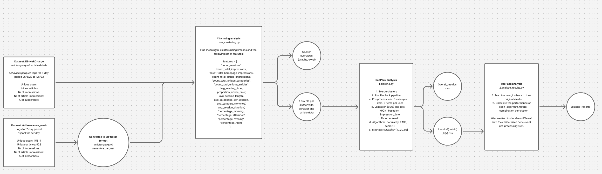

# RICON analysis

## Overview

## Description

This is a monorepo for the RICON analysis, containing the code for the user clustering and the subsequent cluster analysis.
We deliberately chose to split the code into two separate parts, to make a clear separation between the clustering itself and the cluster analysis.

## How to run

1. Clone the repository
2. cd 1-user-clustering
3. Create a virtual environment
4. Install the dependencies
5. Run the script

6. Move the resulting clusters to the 2-cluster-analysis folder
7. cd 2-cluster-analysis
8. Create a virtual environment
9. Install the dependencies
10. Run the script

## Datasets

### Addressa one_week

### Ekstra 7_days
