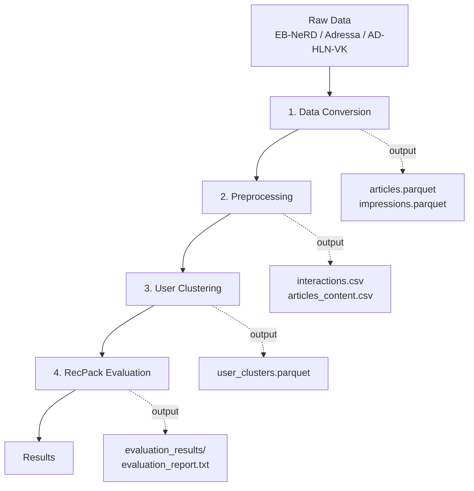

# News Recommender Analysis Pipeline

A modular framework for user clustering and recommendation evaluation in news recommendation systems.

## Overview

This project provides tools for:
1. **Data Conversion** – Converting various dataset formats to a standard schema
2. **User Clustering** – Clustering users based on behavioral features (categories, time patterns, activity)
3. **Recommendation Evaluation** – Evaluating algorithms (Popularity, ItemKNN, EASE, MultVAE, CB-ST) using RecPack

### Pipeline Flow


```mermaid
flowchart TB
    RAW[Raw Data<br/>EB-NeRD / Adressa / AD-HLN-VK] --> C1[1. Data Conversion]
    C1 --> C2[2. Preprocessing]
    C2 --> C3[3. User Clustering]
    C3 --> C4[4. RecPack Evaluation]
    C4 --> RES[Results]

    C1 -.->|output| O1[articles.parquet<br/>impressions.parquet]
    C2 -.->|output| O2[interactions.csv<br/>articles_content.csv]
    C3 -.->|output| O3[user_clusters.parquet]
    C4 -.->|output| O4[evaluation_results/<br/>evaluation_report.txt]
```

**Optional steps before running the pipeline:**
- **EB-NeRD:** `combine_behaviors.py` (merge train/validation) → `generate_embeddings.py` (if CB-ST)
- **Adressa:** `generate_embeddings.py` (if CB-ST)
- **AD/HLN/VK:** Embeddings from `article_metadata.csv` during conversion

| Step | Description |
|------|--------------|
| **1. Data Conversion** | Convert raw format (Parquet, JSONL, Spark CSV) → standard schema |
| **2. Preprocessing** | Validate, clean, create interactions (article-only) and article content. See details below. |
| **3. User Clustering** | Extract behavioral features, K-Means clustering, assign cluster IDs |
| **4. RecPack Evaluation** | Train algorithms once on all interactions; compute per-user metrics; aggregate by cluster (NDCG@K, Recall@K, etc.). See Evaluation section. |

**Preprocessing details:**
- **Validation** – Check articles and impressions against expected schema (required columns, types, duplicates)
- **Cleaning** – Remove duplicate impressions; filter out bot-like sessions (>50 impressions/session); normalize category strings (strip, lowercase)
- **Clustering data** – Keep all users and homepage views (no user filtering); homepage behavior is a clustering signal
- **interactions.csv** – Extract article-only rows (user_id, article_id, impression_time) for RecPack evaluation
- **articles_content.csv** – Combine category + title (or + body in full mode) for CB-ST; skipped in embeddings-only mode

## Installation

```bash
git clone <repository-url>
cd not-one-recommender-to-fit-them-all
pip install -r requirements.txt
```

**Optional dependencies:**
- **RecPack** – Required for evaluation (`pip install recpack`)
- **Sentence Transformers** – Required for CB-ST (`pip install sentence-transformers`)
- **Annoy** – For approximate nearest neighbors (`pip install annoy`)

---

## Dataset Quick Reference

| Dataset | Format | Download | Config |
|---------|--------|----------|--------|
| **EB-NeRD** | Parquet | [recsys.eb.dk](https://recsys.eb.dk/) | `config_ebnerd.json` |
| **Adressa** | JSONL | [reclab.idi.ntnu.no](https://reclab.idi.ntnu.no/dataset/) | `config_adressa.json` |
| **AD / HLN / VK** | S3 Spark CSV | Internal S3 bucket | `config_ad.json`, `config_hln.json`, `config_vk.json` |

---

## Step-by-Step: EB-NeRD (SageMaker from Scratch)

EB-NeRD is the Danish news dataset from Ekstra Bladet. Use this guide to run the full pipeline on SageMaker.

### 1. Download the dataset

Request access at [recsys.eb.dk](https://recsys.eb.dk/) and fill the form. Once approved, download:

```bash
# On SageMaker (or local)
mkdir -p data/ebnerd
wget https://ebnerd-dataset.s3.eu-west-1.amazonaws.com/ebnerd_large.zip
unzip ebnerd_large.zip -d data/ebnerd/
rm ebnerd_large.zip
```

If the zip extracts to a nested folder, ensure the final path is `data/ebnerd/ebnerd_large/` with `articles.parquet` and `train/` directly inside.

**Expected structure after download:**
```
data/ebnerd/ebnerd_large/
├── articles.parquet          # Shared across splits
├── train/
│   ├── behaviors.parquet
│   └── history.parquet
└── validation/
    ├── behaviors.parquet
    └── history.parquet
```

### 2. Combine behaviors (required)

Merge train and validation behaviors into a single file:

```bash
python scripts/combine_behaviors.py --input-dir data/ebnerd/ebnerd_large
```

This creates `data/ebnerd/ebnerd_large/behaviors.parquet`.

### 3. Generate embeddings for CB-ST (required if CB-ST enabled)

```bash
python scripts/generate_embeddings.py --input-dir data/ebnerd/ebnerd_large
```

Creates `data/ebnerd/ebnerd_large/title_category_embeddings.parquet`. Use `--model intfloat/multilingual-e5-base` for faster runs; add `--batch-size 128` on GPU instances.

### 4. Run the pipeline

```bash
python scripts/run_full_pipeline.py --config config_ebnerd.json
```

Or with CLI overrides:

```bash
python scripts/run_full_pipeline.py --dataset ebnerd --input-dir data/ebnerd/ebnerd_large --legacy-features --n-clusters 4
```

### SageMaker tips for EB-NeRD

| Dataset size | Instance | Notes |
|--------------|----------|-------|
| demo/small | ml.m5.xlarge (16 GB) | Quick tests |
| large | ml.m5.4xlarge (64 GB) | Full pipeline |
| large + CB-ST | ml.g4dn.xlarge (GPU) | Faster embeddings |

**Option A – Run on instance with local data:** After downloading and preparing data on the SageMaker instance, run the pipeline with `input_path` pointing to the local directory (e.g. `/home/ec2-user/data/ebnerd/ebnerd_large`).

**Option B – Use SageMaker Processing Job:** Upload data to S3, then create a Processing Job that mounts S3 to `/opt/ml/input/data/training`. Update config with `input_path: "/opt/ml/input/data/training"` and set `output` to `/opt/ml/output`. See `docs/sagemaker_config.md` for a full Processing Job example.

---

## Step-by-Step: Adressa (SageMaker from Scratch)

Adressa is the Norwegian news dataset from NTNU Reclab.

### 1. Download the dataset

Download from [reclab.idi.ntnu.no/dataset](https://reclab.idi.ntnu.no/dataset/):

- **Light 1 week:** [one_week.tar.gz](https://reclab.idi.ntnu.no/dataset/one_week.tar.gz) (~1.4 GB)
- **Light 10 weeks:** [three_month.tar.gz](https://reclab.idi.ntnu.no/dataset/three_month.tar.gz) (~16 GB)

```bash
# On SageMaker (or local)
mkdir -p data/adressa
wget https://reclab.idi.ntnu.no/dataset/one_week.tar.gz -O data/adressa/one_week.tar.gz
tar -xzf data/adressa/one_week.tar.gz -C data/adressa/
# Ensure JSONL files end up in data/adressa/one_week/ (rename extracted folder if needed)
rm data/adressa/one_week.tar.gz
```

**Expected structure:**
```
data/adressa/one_week/
├── 20170101.jsonl
├── 20170102.jsonl
├── ...
└── 20170107.jsonl
```

Each JSONL line: `{"userId": "...", "time": 1483228800, "url": "...", "title": "...", "id": "..."}`

### 2. Generate embeddings for CB-ST (required if CB-ST enabled)

```bash
python scripts/generate_embeddings.py --input-dir data/adressa/one_week
```

### 3. Run the pipeline

```bash
python scripts/run_full_pipeline.py --config config_adressa.json
```

Or:

```bash
python scripts/run_full_pipeline.py --dataset adressa --input-dir data/adressa/one_week --legacy-features --n-clusters 3
```

### SageMaker tips for Adressa

- **1 week:** ml.m5.large or ml.m5.xlarge
- **10 weeks:** ml.m5.4xlarge
- No `combine_behaviors` step needed (Adressa uses single JSONL files)

---

## Step-by-Step: AD / HLN / VK (SageMaker from Scratch)

AD, HLN, and VK use the same Spark CSV format on S3. Data is typically exported from production systems.

### 1. Expected S3 layout

```
s3://<bucket>/<prefix>/<dataset>/
├── article_metadata.csv
└── impressions/
    ├── event_type=home_page_view/
    │   └── part-*.csv
    └── event_type=article_page_view/
        └── part-*.csv
```

`article_metadata.csv` must include `bert_embedding` for CB-ST (no separate `generate_embeddings.py` step).

### 2. IAM permissions

SageMaker execution role needs:
- `s3:ListBucket` on the dataset bucket/prefix
- `s3:GetObject` on dataset objects
- Optional: `s3:PutObject` to sync results back

### 3. Update config

Create or edit `config_ad.json` (or `config_hln.json`, `config_vk.json`):

```json
{
  "dataset": {
    "name": "ad",
    "input_path": "s3://<bucket>/<prefix>/ad",
    "format": "spark_csv",
    "event_types": ["home_page_view", "article_page_view"],
    "start_time_min": null,
    "start_time_max": null
  },
  "clustering": {
    "k_selection_method": "elbow",
    "legacy_features": true
  },
  "evaluation": {
    "k_values": [10, 20, 50],
    "content_mode": "embeddings"
  }
}
```

Use `start_time_min` and `start_time_max` for smoke tests (e.g. one week).

### 4. Run the pipeline

```bash
python scripts/run_full_pipeline.py --config config_ad.json
```

### SageMaker tips for AD/HLN/VK

| Scale | Instance | Notes |
|-------|----------|-------|
| Smoke test | ml.m5.xlarge | Use `start_time_min`/`max` to limit data |
| Medium | ml.m5.4xlarge | 64 GB RAM |
| Large | ml.r5.8xlarge | 256 GB RAM |
| Very large | ml.r5.16xlarge | 512 GB RAM |

**Smoke test (recommended first):**
```bash
python scripts/run_full_pipeline.py \
  --dataset ad \
  --input-dir s3://<bucket>/<prefix>/ad \
  --n-clusters 3 \
  --skip-evaluation
```

Then remove limits for the full run.

### Embeddings for CB-ST on AD/HLN/VK

AD includes `bert_embedding` in `article_metadata.csv`. The converter creates `runs/<run_id>/data/title_category_embeddings.parquet` automatically. No `generate_embeddings.py` step is required.

---

## Configuration

### Config file structure

```json
{
  "dataset": {
    "name": "ebnerd",
    "input_path": "data/ebnerd/ebnerd_large"
  },
  "clustering": {
    "k_selection_method": "elbow",
    "legacy_features": true
  },
  "evaluation": {
    "k_values": [10, 20, 50],
    "train_on_full_dataset": true,
    "n_most_recent_in": 30,
    "algorithms": [
      {"name": "Popularity", "enabled": true},
      {"name": "ItemKNN", "enabled": true},
      {"name": "EASE", "enabled": true},
      {"name": "MultVAE", "enabled": true, "params": {"max_epochs": 20}},
      {"name": "CB-ST", "enabled": true}
    ]
  }
}
```

### Preset configs

| Preset | Description |
|--------|-------------|
| `ebnerd` | Danish news (EB-NeRD/Ekstra Bladet) |
| `adressa` | Norwegian news (Adressa) |
| `ad` | AD dataset, S3 Spark CSV |
| `hln` | HLN dataset, same format as ad |
| `vk` | VK dataset, same format as ad |

---

## Algorithms

- **Popularity** – Most popular items
- **ItemKNN** – Item-based k-nearest neighbors
- **EASE** – Embarrassingly Shallow Autoencoders
- **MultVAE** – Variational autoencoder (RecPack)
- **CB-ST** – Sentence Transformer embeddings (requires pre-calculated embeddings for EB-NeRD/Adressa)

**CB-ST:** For EB-NeRD and Adressa, run `generate_embeddings.py` before the pipeline. For AD/HLN/VK, embeddings come from `article_metadata.csv` during conversion.

**Apple Silicon:** On M1/M2/M3/M4 Macs, Annoy may return only 1 neighbor. Use `CB-ST-sklearn` instead of `CB-ST`.

---

## Evaluation

**Legacy mode (default):** Training is done **once on all interactions**; evaluation is per cluster.

1. **Training:** All recommendation algorithms (Popularity, ItemKNN, EASE, MultVAE, CB-ST) are trained on the full interaction matrix (all users).
2. **Per-user metrics:** Each user is predicted and scored (NDCG@K, Recall@K, Precision@K).
3. **Aggregation:** Metrics are aggregated by cluster (mean per cluster) to compare performance across user segments.

This matches the original `00_legacy` pipeline: one model, cluster-level evaluation.

- **Scenario:** LastItemPrediction (last interaction held out for testing; `n_most_recent_in=30` for training)
- **Metrics:** NDCG@K, Recall@K, Precision@K, Coverage@K, Gini@K, topic-level diversity
- **Grid search:** ItemKNN and EASE use grid search (optimized by NDCG@100)
- **Filtering:** Session bot filter (>50 interactions/session), min 5 article interactions per user
- **Coverage:** `coverage_summary.csv` logs per-cluster coverage (recpack users / original users)

**Alternative mode:** Use `--train-per-cluster` to train a separate model per cluster.

---

## Output

Results are saved under `runs/<dataset>_<timestamp>/`:

```
runs/ebnerd_20241215_120000/
├── config.json
├── articles.parquet, impressions.parquet, interactions.csv
├── user_clusters.parquet
├── evaluation_results/
│   ├── cluster_0_results.csv
│   ├── cluster_1_results.csv
│   ├── ...
│   ├── legacy_format/           # Per-user files (Algorithm_k.csv)
│   └── coverage_summary.csv     # Per-cluster coverage
└── evaluation_report.txt
```

**Sync to S3:**
```bash
aws s3 sync runs/ s3://<bucket>/<results-prefix>/runs/
```

---

## Project Structure

```
not-one-recommender-to-fit-them-all/
├── src/
│   ├── config/           # settings.py, schema.py
│   ├── converters/        # adressa.py, ebnerd.py, generic.py
│   ├── preprocessing/     # validators, cleaners, transformers
│   ├── clustering/        # feature engineering, K-Means
│   └── evaluation/       # RecPack pipeline, algorithms
├── scripts/
│   ├── run_full_pipeline.py
│   ├── run_conversion.py, run_clustering.py, run_evaluation.py
│   ├── combine_behaviors.py    # EB-NeRD only
│   └── generate_embeddings.py  # EB-NeRD, Adressa
├── config_ebnerd.json, config_adressa.json, config_ad.json, ...
└── requirements.txt
```

---

## Development

```bash
pytest tests/ -v
pytest tests/ --cov=src --cov-report=html
```

---

## License

[Specify license]

## Citation

```bibtex
@misc{ricon-analysis,
  title={RICON Analysis Pipeline},
  year={2024},
  url={repository-url}
}
```
